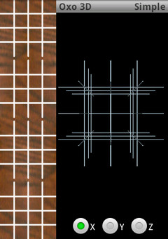
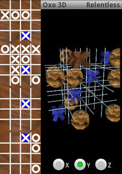
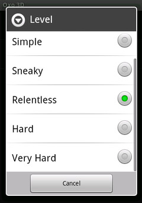

<em>Oxo 3D</em> is a 3 dimensional (4x4x4) noughts-and-crosses / tic-tac-toe game for the Android operating system.  This is a game with considerably more strategy than the traditional 3x3 version!

Here are some screenshots of the game in action

  
  
  

<h3>Download</h3>

<h4>From the market</h4>

  
  Touch the image in your android device browser, or scan the image code

 

<h4>Direct</h4>

You'll need to enable <i>Settings =&gt; Applications =&gt; Unknown Sources</i>

<a href="../../software/Oxo3d-v0.94.apk">Version 0.94</a>

<h3>Upcoming</h3>
<ul>
  <li>Fix 'Game replay went wrong bug' (its complicated!)</li>
  <li>Make 2 player version - top user request</li>
  <li>Implement simplified 3D only view</li>
</ul>
