# Infinity mirror with Raspberry Pi Pico, Neopixels and Micropython

Here is an account of how I renovated our old infinity mirror to this:

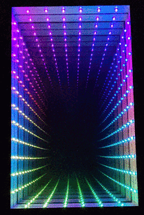

From this:

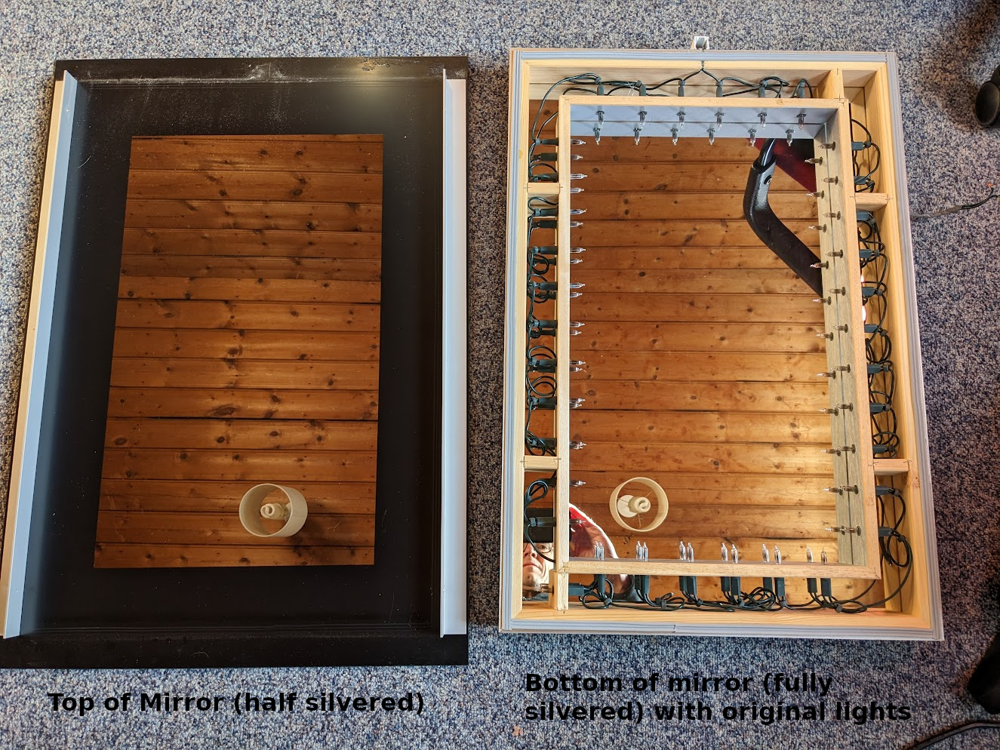

This isn't a recipe on how to do this yourself (though you could
certainly use it like that), its an account of exactly what I did,
including all the bits where I wasn't sure where I was going in the
hope it will help less experienced constructors with the thought
process.

## The mirror

A long time ago my wife and I were looking in a lighting shop and we
came across the infinity mirror. I was immediately captivated by it
and we had it installed in our bathroom when we had it renovated.

Fast forward more than a decade and the lights in the infinity mirror
had stopped working. I had never taken it apart to see how to fix it
which I really should have done but you know how you get used to
things not working...

Just before Christmas 2022 I decided I would like to have a project to
work on over the holiday period, so after a very brief bit of
research I ordered:

- 40 plated through hole neopixel LEDs
- 2 raspberry pi pico W microcontrollers
- 5V 2A PSU
- 40 x 330uF capacitors
- 40 x 330Ohm resistors
- Some more wire since I had run out

I chose the plated through LED style neopixels because I knew they'd
be visible in the mirror and I wanted them to look nicer than the
neopixel strips. I knew I needed 34 LEDs but I ordered some extra for
testing. I ended up breaking a couple of them so just as well.

I chose the pi pico because I'd done a project with that before with
C++ but I thought it would be fun to try micropython (which I hadn't
tried before).

The resistors and caps I chose after a bit of looking at the
datasheet. Spoiler - I didn't need these in the end and I did need
some decoupling caps instead - see later.

I made that order in the full knowledge that it wouldn't be everything
I needed and that there may be stuff in there that I didn't need. When
getting going on a project its much more important for me to make a
start even if it is in the wrong direction than to wait until I've
planned everything out to the last degree.

Later I ended up ordering:

- 40 x 10nF ceramic capacitors
- 50 x bezel mounts for the 5mm LEDs
- 5 x 100k pots with nice knobs
- 5 x switches

### Neopixels

Once the stuff arrived I took some photos to see how the neopixels
worked inside.

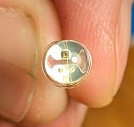

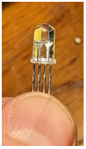

You can see the 3 LED chips and also the controller chip all connected
together with very fine wire in the LED encapsulation.

Neopixels have 4 connections, `Volts`, `Ground`, `Data In` and `Data
Out`. You chain them up `Data In` to `Data Out` and you connect the
first `Data In` to your microcontroller (in this case a Raspberry Pi
Pico). The microcontroller generates a serial data stream with 24 bit
color for each neopixel. The first neopixel uses the first block of
pixel data to color itself and passes the rest of the stream on. This
means you can chain hundreds of them together with only one pin on
your microcontroller and address each one individually.

## Neopixels and micropython

The first thing I wanted to do was to make a neopixel work from
micropython to give me some confidence that the project would work.

I made a plan like this:

1. Install micropython on the pi pico and make it work
2. Breadboard a single neopixel to see if that works
3. Breadboard a chain of neopixels to see if they work

I fully expected these steps to be very hard - bringing up new
hardware is always troublesome.

### Installing micropython

Installing micropython turned out to be very easy. I installed the
micropython firmware from here

https://www.raspberrypi.com/documentation/microcontrollers/micropython.html

Using Pico W version `rp2-pico-w-20230116-unstable-v1.19.1-803-g1583c1f67.uf2`

I then needed to work out how to communicate with micropython. I tried
`thonny` but I don't really like graphical clicky GUIs and eventually
I found that Ubuntu packaged `rshell` which worked and let me use a
REPL on the board and transfer files into the flash.

This was so easy compared to microcontroller development I've done in
the past - well done Raspberry Pi and Micropython.

Having a REPL on the board meant I could do little experiments to see
if bits of hardware were working just by typing python snippets.

### First light

I soldered on 7 pins to the pico (just enough for power, IO and to
stop it wobbling) then I plugged it into a breadboard with a single
neopixel.

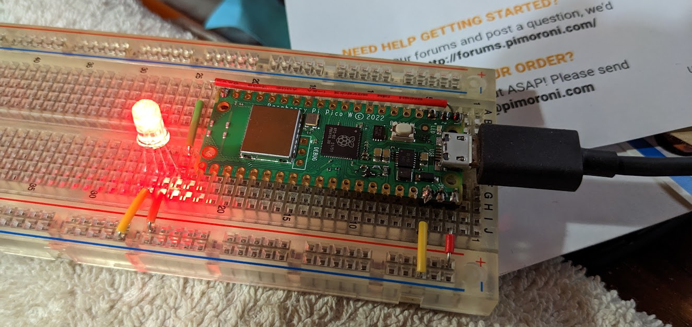

It took me a little while to discover that there is a built in
neopixel library in the pico micropython. I found an external library
first but decided to use the built in library after evaluating it.

I could then use the REPL from `rshell` to write code and try to make
neopixel work.

This should set the LED to a pink color:

```py
from neopixel import NeoPixel
import machine
pin = machine.Pin(0)
pixels = NeoPixel(pin, 1)
pixels.fill((255, 5, 20))
pixels.write()
```

However it didn't set it to pink at all! Eventually I worked out that
the ordering of RGB seems to be wrong. I looked in the source for the
neopixel python library and saw I could fix it like this:

```py
NeoPixel.ORDER = (0, 1, 2, 3)
```

So a test of the LED became:

```py
from neopixel import NeoPixel
NeoPixel.ORDER = (0, 1, 2, 3)
import machine
pin = machine.Pin(0)
pixels = NeoPixel(pin, 1)
pixels.fill((255, 5, 20))
pixels.write()
```

It was a relief to get over that hurdle - it seemed then that the
project might work after all.

### Fifth light

I then extended the breadboard with 4 more neopixels for 5 in total
and tried to make that work.

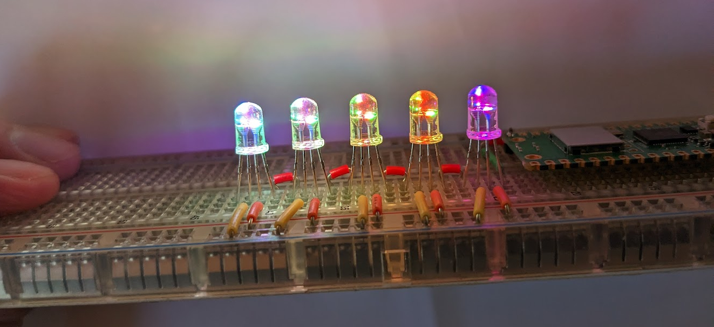

I then had fun noodling around with python to try to make some
interesting patterns.



Note that the neopixels are extremely bright when on full power so I
did most of this testing with a bit of white paper over the neopixels.
When the neopixels are in the mirror they will shine sideways not
towards the viewer to make interesting internal reflections. This
worked out very well.

### Knobs

At this point I realised it would be nice if the user had some control
over the display. A brightness knob at minimum would be nice!

The Pico has 3 ADC pins so I bought some 100k pots with knobs off eBay
and wired them up and soldered them to the pico.



Later I discovered that 100k was too big a value as they are a bit
noisy and can't quite pull up and down to the rails due to the
internal resistance of the pico ADC. I chose the 100k to save a bit of
power but it was a mistake - 10k pots would have been better. I left
them at 100k though and did a bit of work in the software to make sure
they could hit completely off and completely on.

I also at this point decided to add two buttons for mode up and mode
down but I didn't make them until later.

## Mechanical work

Now that I had proved the concept of the pico and neopixels it was
time for me to disassemble the mirror. I really should have done this
before I started, but I guess I enjoy the feeling of not knowing what
I'm doing ;-)


You can see the mirror has what is essentially a string of Christmas
lights inside. These gave a beautiful creamy light so I hope I don't
destroy that with the LEDs.

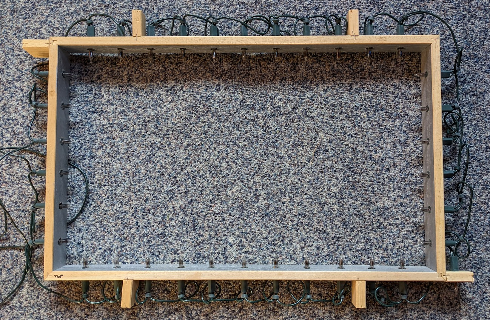

Each Christmas light came out through a hole about 10mm in diameter
and I had to work out how to fit the LEDs which are 5mm in diameter
into those holes neatly. This is all very visible so it had to look
nice.

This was probably the hardest part of the project for me. If I had a
3D printer I guess I could have printed something up.

After a lot of messing about, I eventually bought some panel mounts
for the LEDs. This made them up to 8 mm in diameter. They were not
quite big enough and it took a lot of force to get the LEDs far enough
into the panel mounts. I broke a couple of LEDs doing it!

Then I cut about 1cm off the end of all the Christmas lights (with a
saw!) so I could re-use the little bit of green plastic tube you see
below and put the panel mount into those which luckily fit perfectly.

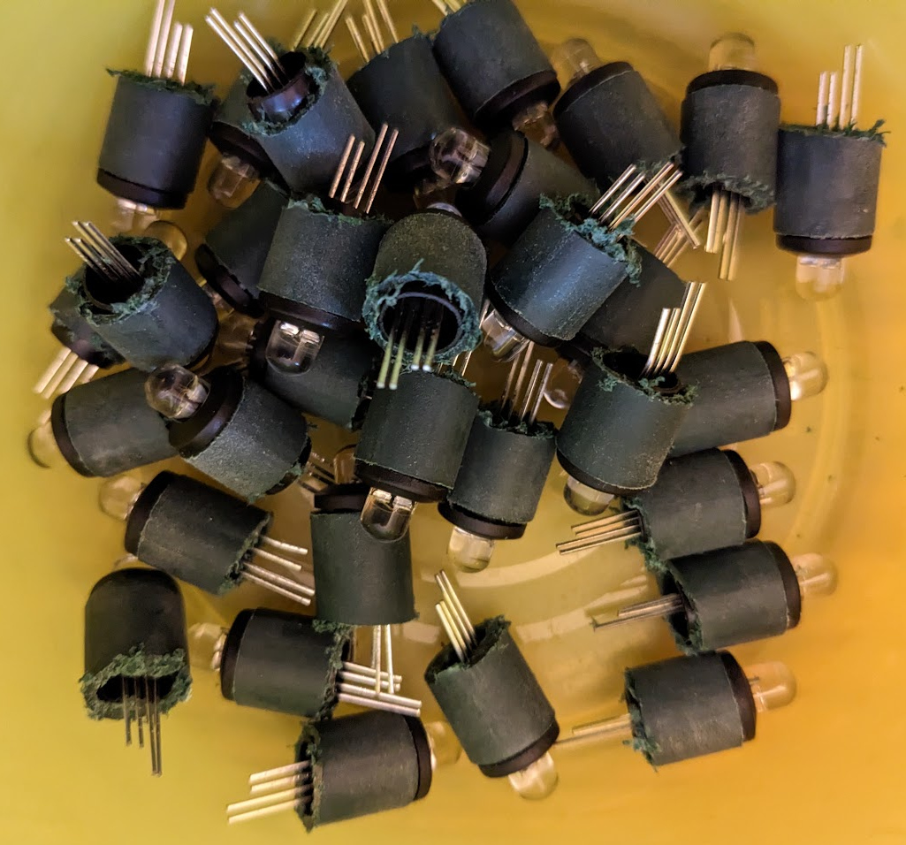

At last the LEDs were ready to fit into the 10mm holes in the frame.

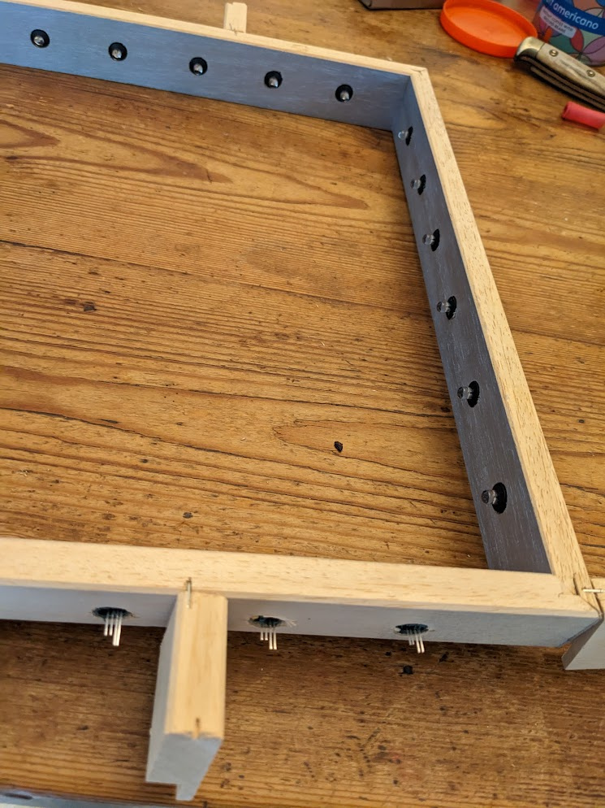

I then soldered the wires to connect up the neopixels. I also soldered
a 10nF decoupling capacitor across the power lines for each one. The
datasheet recommended feeding each one through a resistor with a
reservoir capacitor, but in my tests the 5V PSU I had bought was
plenty capable of dealing with the power surges so I just went for a
decoupling capacitor to minimise noise.

This was a lot of soldering - it took about 4 hours to make and solder
all the wires. There are 3 wires for each LED that needed making and 4
solder joints, so 204 wire ends to strip and tin and 102 joints to
make with 3 or 4 things being soldered together!

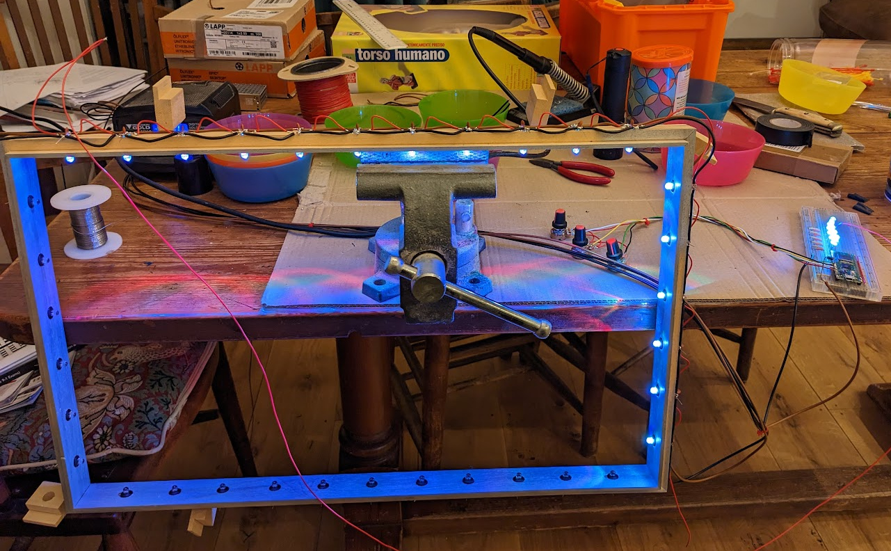

With the benefit of 20/20 hindsight and a bit more searching eBay and
Amazon I could have bought a string of Christmas light neopixels which
probably would have done the job with much less soldering.

I then connected the breadboard and made sure the lights worked.

## Software

Now the hardware unknowns were beaten for the moment it was time to
get back to the software.

You can [download the software from github](https://github.com/ncw/mirror).

One thing I did do which I recommend you always do when working with
embedded stuff is write a simulator.

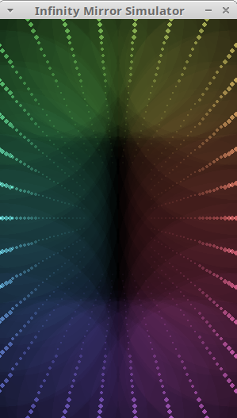

I used pygame for this. This meant I could test and debug the display
modes on my desktop which was a much quicker cycle than testing on the
raspberry pi pico. It's also a nice thing to have - you can download
the code from the github repo and try it yourself even if you don't
have any hardware.

I went through a few iterations of how exactly to split the code
between the simulator and micropython but in the end passing a
`mirror` object to each mode turned out the easiest.

I experimented with different frame rates and I found that 50 Hz was
too fast - some of the modes were dropping frames so I settled on 25
Hz.

I also experimented with running the refresh off a timer interrupt in
micropython. This worked for a while and then locked up and I
conjecture I was doing too much on the interrupt. I switched it over
to a timed sleep and it became 100% reliable after that.

I experimented with lots of different modes and had the idea of using
the board's temperature sensor for a temperature display mode and using
the on board WiFi to pick up the current time for a clock mode. The
clock mode actually works really well - with a few minutes' practice you
can read it just like any analogue clock.

## Final assembly

Now that the software was looking good I went back to the hardware
side for the final assembly.

I needed to get the pico off the bread board and mounted into the mirror somehow.

In the end I decided to make a piece of wood which I would velcro
underneath the mirror (there is a small gap so it won't be visible)
and put the pico and knobs there.



This taxed my meagre carpentry skills. I made a mistake with the
knobs - the bit of wood I chose was too thick to put the nuts on the
knob shafts to hold them in which was a bit of a disaster. However I
decided to epoxy them and the buttons in place which made a nice
result provided I don't ever want to take them off again.

I fed the power (5V, GND) in to the top of the mirror and out of the
bottom of the mirror comes 3 wires, 5V, GND and the input to the
string of neopixels. The 5V line goes via a diode to VSYS on the pico
so that the pico can be powered via the USB or by the external 5V PSU.
This arrangement is outlined in the datasheet for the pico.

> VBUS is the 5V input from the micro-USB port, which is fed through a
> Schottky diode to generate VSYS. The VBUS to VSYS diode (D1) adds
> flexibility by allowing power ORing of different supplies into VSYS.

and later

> The simplest way to safely add a second power source to Pico is to
> feed it into VSYS via another Schottky diode (see Figure 15). This
> will 'OR' the two voltages, allowing the higher of either the
> external voltage or VBUS to power VSYS, with the diodes preventing
> either supply from back-powering the other.

We will run the LEDs directly from an external 5V power supply. Since
the VSYS input range is 1.8V to 5.5V we don't need to worry about a
diode drop, so any silicon diode should be fine.

- So via a diode connect external 5V PSU to VSYS
- Leave VBUS unconnected (since it connects directly to the USB power)

This will allow us to connect a computer and not blow up the computer
with the external 5V PSU.

The neopixel drive is connected to GP0 via a 330Ohm resistor. Why the
resistor? Just in case the pin gets shorted to 5V - that will save the
pico in that case.

I made connectors for the 3 wires to the pico board so I could take it
off and things are very nearly done.

## Conclusion

That was a lot of fun. The mirror is somewhat mesmerising in the color
cycling modes. It also made the wife happy to have the infinity mirror
working again, so win-win-win :-)



## Thanks

- Dougal for helping me with the wire stripping
- Dave Lawrence for writing the Matrix and ChaseRGB modes
