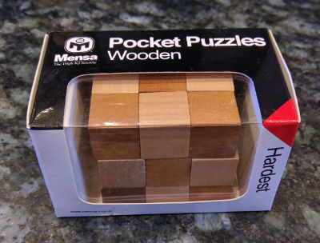
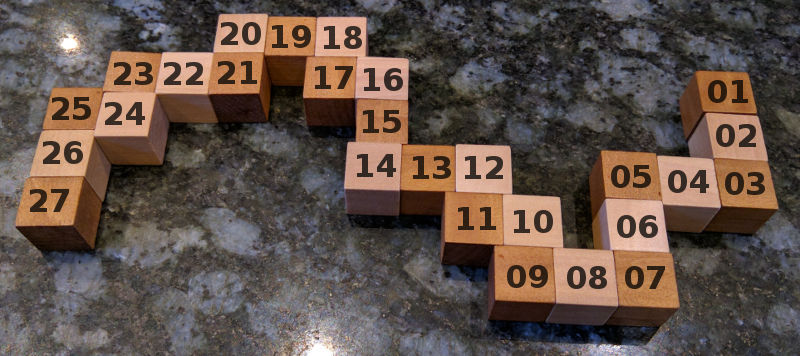

My family know I like puzzles so they gave me this one recently:


The code for this along with a Jupyter notebook for it is [on
github](https://github.com/ncw/snake-puzzle/).




When you take it out the box it looks like this:


And very soon after it looked like this (which explains why I've
christened the puzzle \"the snake puzzle\"):


The way it works is that there is a piece of elastic running through
each block. On the majority of the blocks the elastic runs straight
through, but on some of the it goes through a 90 degree bend. The puzzle
is trying to make it back into a cube.

After playing with it a while, I realised that it really is quite hard
so I decided to write a program to solve it.

The first thing to do is find a representation for the puzzle. Here is
the one I chose:

```py3
# definition - number of straight bits, before 90 degree bend
snake = [3,2,2,2,1,1,1,2,2,1,1,2,1,2,1,1,2]
assert sum(snake) == 27
```

If you look at the picture of it above where it is flattened you can see
where the numbers came from. Start from the right hand side.

That also gives us a way of calculating how many combinations there are.
At each 90 degree joint, there are 4 possible rotations (ignoring the
rotations of the 180 degree blocks) so there are:

```py3
>>> 4**len(snake)
17179869184
```

17 billion combinations. That will include some rotations and
reflections, but either way it is a big number.

However it is very easy to know when you've gone wrong with this kind
of puzzle - as soon as you place a piece outside of the boundary of the
3x3x3 block you know it is wrong and should try something different.

So how to represent the solution? The way I've chosen is to represent
it as a 5x5x5 cube. This is larger than it needs to be but if we fill in
the edges then we don't need to do any complicated comparisons to see
if a piece is out of bounds. This is a simple trick but it saves a lot
of code.

I've also chosen to represent the 3d structure not as a 3d array but as
a 1D array (or `list` in python speak) of length 5 x 5 x 5 = 125.

To move in the `x` direction you add 1, to move in the `y` direction you
add 5 and to move in the `z` direction you move 25. This simplifies the
logic of the solver considerably - we don't need to deal with vectors.

The basic definitions of the cube look like this:

```py3
N = 5
xstride=1    # number of pieces to move in the x direction
ystride=N    # number of pieces to move in the y direction
zstride=N*N  # number of pieces to move in the z direction
```

In our `list` we will represent empty space with `0` and space which
can't be used with `-1`:

```py3
empty = 0
```

Now define the empty cube with the boundary round the edges:

```py3
# Define cube as 5 x 5 x 5 with filled in edges but empty middle for
# easy edge detection
top = [-1]*N*N
middle = [-1]*5 + [-1,0,0,0,-1]*3 + [-1]*5
cube = top + middle*3 + top
```

We're going to want a function to turn `x, y, z` co-ordinates into an
index in the `cube` list:

```py3
def pos(x, y, z):
    """Convert x,y,z into position in cube list"""
    return x+y*ystride+z*zstride
```

So let's see what that cube looks like:

```py3
def print_cube(cube, margin=1):
    """Print the cube"""
    for z in range(margin,N-margin):
        for y in range(margin,N-margin):
            for x in range(margin,N-margin):
                v = cube[pos(x,y,z)]
                if v == 0:
                    s = " . "
                else:
                    s = "%02d " % v
                print(s, sep="", end="")
            print()
        print()
```

```py3
>>> print_cube(cube, margin = 0)
-1 -1 -1 -1 -1 
-1 -1 -1 -1 -1 
-1 -1 -1 -1 -1 
-1 -1 -1 -1 -1 
-1 -1 -1 -1 -1 

-1 -1 -1 -1 -1 
-1  .  .  . -1 
-1  .  .  . -1 
-1  .  .  . -1 
-1 -1 -1 -1 -1 

-1 -1 -1 -1 -1 
-1  .  .  . -1 
-1  .  .  . -1 
-1  .  .  . -1 
-1 -1 -1 -1 -1 

-1 -1 -1 -1 -1 
-1  .  .  . -1 
-1  .  .  . -1 
-1  .  .  . -1 
-1 -1 -1 -1 -1 

-1 -1 -1 -1 -1 
-1 -1 -1 -1 -1 
-1 -1 -1 -1 -1 
-1 -1 -1 -1 -1 
-1 -1 -1 -1 -1 
```

Normally we'll print it without the margin.

Now let's work out how to place a segment.

Assuming that the last piece was placed at `position` we want to place a
segment of `length` in `direction`. Note the `assert` to check we
aren't placing stuff on top of previous things, or out of the edges:

```py3
def place(cube, position, direction, length, piece_number):
    """Place a segment in the cube"""
    for _ in range(length):
        position += direction
        assert cube[position] == empty
        cube[position] = piece_number
        piece_number += 1
    return position
```

Let's just try placing some segments and see what happens:

```py3
>>> cube2 = cube[:] # copy the cube
>>> place(cube2, pos(0,1,1), xstride, 3, 1)
>>> print_cube(cube2)
01 02 03 
 .  .  . 
 .  .  . 

 .  .  . 
 .  .  . 
 .  .  . 

 .  .  . 
 .  .  . 
 .  .  . 
```

```py3
>>> place(cube2, pos(3,1,1), ystride, 2, 4)
>>> print_cube(cube2)
01 02 03 
 .  . 04 
 .  . 05 

 .  .  . 
 .  .  . 
 .  .  . 

 .  .  . 
 .  .  . 
 .  .  . 
```

```py3
>>> place(cube2, pos(3,3,1), zstride, 2, 6)
>>> print_cube(cube2)
01 02 03 
 .  . 04 
 .  . 05 

 .  .  . 
 .  .  . 
 .  . 06 

 .  .  . 
 .  .  . 
 .  . 07 
```

The next thing we'll need is to undo a place. You'll see why in a
moment.

```py3
def unplace(cube, position, direction, length):
    """Remove a segment from the cube"""
    for _ in range(length):
        position += direction
        cube[position] = empty
```

```py3
>>> unplace(cube2, pos(3,3,1), zstride, 2)
>>> print_cube(cube2)
01 02 03 
 .  . 04 
 .  . 05 

 .  .  . 
 .  .  . 
 .  .  . 

 .  .  . 
 .  .  . 
 .  .  . 
```

Now let's write a function which returns whether a move is valid given
a current `position` and a `direction` and a `length` of the segment we
are trying to place.

```py3
def is_valid(cube, position, direction, length):
    """Returns True if a move is valid"""
    for _ in range(length):
        position += direction
        if cube[position] != empty:
            return False
    return True
```

```py3
>>> is_valid(cube2, pos(3,3,1), zstride, 2)
True
```

```py3
>>> is_valid(cube2, pos(3,3,1), zstride, 3)
False
```

Given `is_valid` it is now straight forward to work out what moves are
possible at a given time, given a `cube` with a `position`, a
`direction` and a `length` we are trying to place.

```py3
# directions next piece could go in
directions = [xstride, -xstride, ystride, -ystride, zstride, -zstride]

def moves(cube, position, direction, length):
    """Returns the valid moves for the current position"""
    valid_moves = []
    for new_direction in directions:
        # Can't carry on in same direction, or the reverse of the same direction
        if new_direction == direction or new_direction == -direction:
            continue
        if is_valid(cube, position, new_direction, length):
            valid_moves.append(new_direction)
    return valid_moves
```

```py3
>>> moves(cube2, pos(3,3,1), ystride, 2)
[-1, 25]
```

So that is telling us that you can insert a segment of length 2 using a
direction of `-xstride` or `zstride`. If you look at previous
`print_cube()` output you'll see those are the only possible moves.

Now we have all the bits to build a recursive solver.

```py3
def solve(cube, position, direction, snake, piece_number):
    """Recursive cube solver"""
    if len(snake) == 0:
        print("Solution")
        print_cube(cube)
        return
    length, snake = snake[0], snake[1:]
    valid_moves = moves(cube, position, direction, length)
    for new_direction in valid_moves:
        new_position = place(cube, position, new_direction, length, piece_number)
        solve(cube, new_position, new_direction, snake, piece_number+length)
        unplace(cube, position, new_direction, length)
```

This works by being passed in the `snake` of moves left. If there are no
moves left then it must be solved, so we print the solution. Otherwise
it takes the head off the `snake` with
`length, snake = snake[0], snake[1:]` and makes the list of valid moves
of that `length`.

Then we `place` each move, and try to `solve` that cube using a
recursive call to `solve`. We `unplace` the move so we can try again.

This very quickly runs through all the possible solutions:

```py3
# Start just off the side
position = pos(0,1,1)
direction = xstride
length = snake[0]
# Place the first segment along one edge - that is the only possible place it can go
position = place(cube, position, direction, length, 1)
# Now solve!
solve(cube, position, direction, snake[1:], length+1)
```

```py3
Solution
01 02 03 
20 21 04 
07 06 05 

16 15 14 
19 22 13 
08 11 12 

17 24 25 
18 23 26 
09 10 27 

Solution
01 02 03 
16 15 14 
17 24 25 

20 21 04 
19 22 13 
18 23 26 

07 06 05 
08 11 12 
09 10 27 
```

Wow! It came up with 2 solutions! However they are the same solution
just rotated and reflected.

But how do you use the solution? Starting from the correct end of the
snake, place each piece into its corresponding number. Take the first
layer of the solution as being the bottom (or top - whatever is
easiest), the next layer is the middle and the one after the top.



After a bit of fiddling around you'll get\...


I hope you enjoyed that introduction to puzzle solving with computer.

If you want to try one yourselves, use the same technique to solve
solitaire.

Download the entire code
[snake_puzzle_solver.py](snake_puzzle_solver.py) or the [iPython
notebook](snake_puzzle_solver.ipynb).
