I wrote this program after playing lots of mancala with my nephew. I don't get to see him very often so I thought he could practice his skills with this program and maybe think of his Uncle Nick. After writing the game engine it naturally evolved to include all the [perfect information](https://en.wikipedia.org/wiki/Perfect_information) games I could find and became the compendium of games you see before you.

[Play online](online/) or see below for installation instructions.

## Download and Install

Head to the [GitHub releases page](https://github.com/ncw/compendium/releases) and grab the latest release for your platform. It is a single binary - download it, unpack it, and double-click to run. No installer required, no dependencies, nothing to configure.

## Screenshots

The main menu lets you pick any of the ten games:

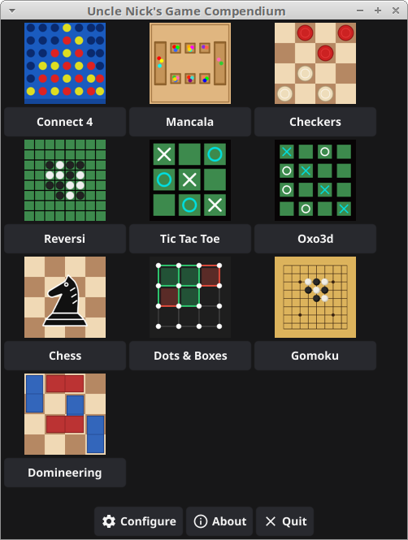

The configuration screen lets you choose difficulty and one- or two-player mode:

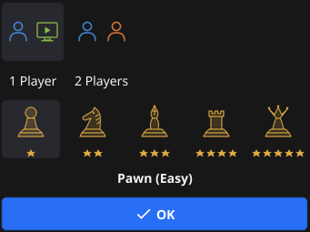

## How to Play

### Difficulty Levels

There are five difficulty levels, each named after a chess piece:

| Level | Name | Chess Elo | Description |
|-------|------|-----------|-------------|
| 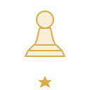 | Pawn | - | Easy - the engine plays at depth 1 and ignores half the moves it finds. Good for young players. |
|  | Knight | ~1160 | Medium - depth 2, ignoring a quarter of its moves. A gentle challenge. |
|  | Bishop | ~1280 | Hard - depth 3, no mistakes. A solid opponent. |
|  | Rook | ~1620 | Very Hard - depth 5 with a one-second time limit. Tough to beat. |
|  | Queen | ~1920 | Expert - depth 20, five-second time limit, multi-threaded search. Good luck. |

Chess Elo ratings were estimated by playing 100 games per level against [Stockfish](https://stockfishchess.org/) configured at the appropriate Elo. The Pawn level scored 0/100 so its Elo is not measurable.

### One Player vs Two Player

You can play against the engine or against a friend sitting next to you. Hit the Configure button from the main menu to switch between modes.

### General Controls

Tap or click on a piece to select it, then tap where you want it to go. The game highlights valid moves to help you along. When the game is over, a banner tells you who won (or whether it was a draw) and you can start a fresh game.

## The Games

### Chess

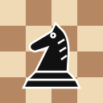

In [chess](https://en.wikipedia.org/wiki/Chess) two players take turns moving pieces on an 8x8 board. White moves first. Each piece type has its own movement rules - pawns march forward, bishops slide diagonally, rooks barrel along ranks and files, and so on. Special moves include [castling](https://en.wikipedia.org/wiki/Castling), [en passant](https://en.wikipedia.org/wiki/En_passant), and [pawn promotion](https://en.wikipedia.org/wiki/Promotion_%28chess%29).

If you aren't sure where to move, clicking on a piece will show you where it can move. Clicking elsewhere will either move the piece to that square (if there is only one choice) or show you all available moves.

Checkmate your opponent's king to win.

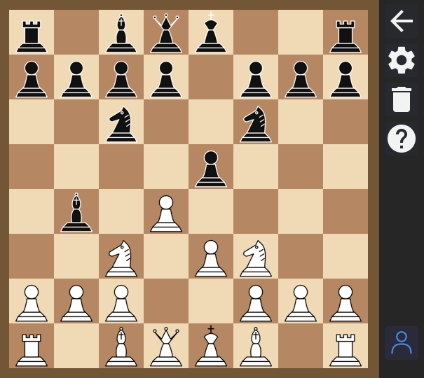

### Checkers/Draughts

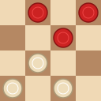

In [checkers (also known as draughts)](https://en.wikipedia.org/wiki/Draughts) two players move pieces diagonally on the dark squares of an 8x8 board. Ordinary pieces move forward only; reach the far side and they become kings, which can move in any diagonal direction. Captures are mandatory - if you can jump, you must. Chain multiple jumps in a single turn to clear the board. Win by capturing all your opponent's pieces or leaving them with no legal moves.

If you aren't sure where to move, clicking on a piece will show you where it can move. Clicking elsewhere will either move the piece to that square (if there is only one choice) or show you all available moves.

The winner takes all the opponents pieces.

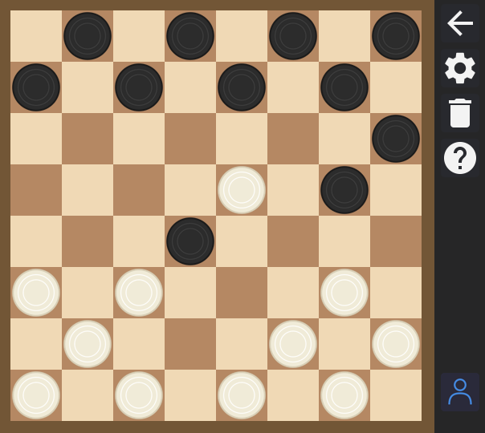

### Reversi

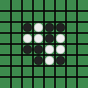

In [reversi](https://en.wikipedia.org/wiki/Reversi) two players place discs on an 8x8 board. Black moves first. Each move must bracket one or more opponent discs between the new disc and an existing friendly disc in a straight line. All bracketed discs are flipped to your colour. If you have no valid moves, your turn is skipped.

When neither player can move, the player with more discs wins.

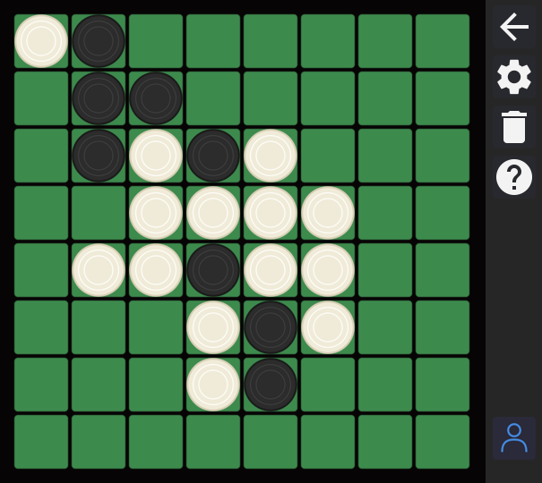

### Connect 4

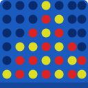

In [connect 4](https://en.wikipedia.org/wiki/Connect_Four) two players take turns dropping coloured counters into a 7-column, 6-row grid. Counters fall to the lowest available row.

The first player to get four in a row (horizontally, vertically, or diagonally) wins. If the board fills up with no winner, it is a draw.

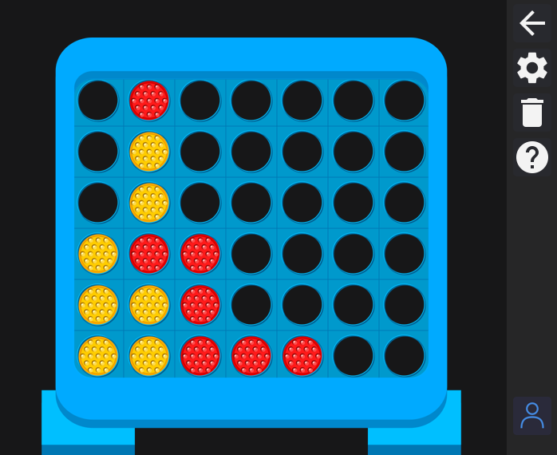

### Mancala

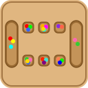

In [mancala](https://en.wikipedia.org/wiki/Mancala) two players sit opposite each other with six pits and a store each. Pick up all stones from one of your pits and sow them one by one counter-clockwise. If your last stone lands in your store, you get another turn. If it lands in an empty pit on your side, you capture that stone and everything in the opposite pit. 

The game ends when one side is empty; remaining stones go to the other player's store. The player with the most stones wins.

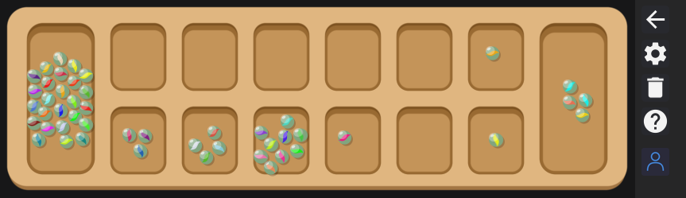

### Gomoku

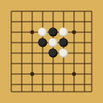

In [gomoku](https://en.wikipedia.org/wiki/Gomoku) two players take turns placing stones on a 15x15 grid. Black goes first. The first player to get five in a row (horizontally, vertically, or diagonally) wins. If the board fills up with no winner, it is a draw.

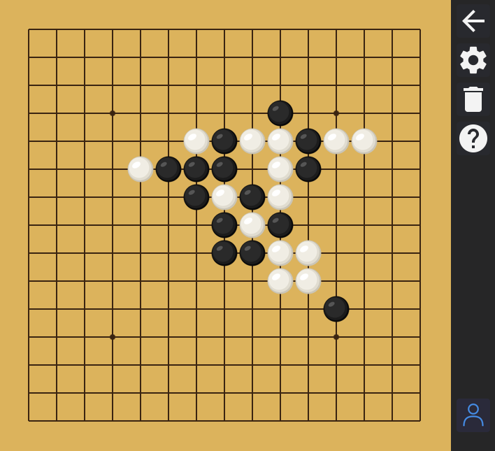

### Tic Tac Toe

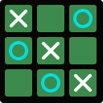

In [tic-tac-toe (noughts and crosses)](https://en.wikipedia.org/wiki/Tic-tac-toe) two players take turns marking squares on a 3x3 grid. X goes first. Get three in a row to win. With perfect play from both sides, the game always ends in a draw - but on Pawn difficulty the engine makes enough mistakes to keep things interesting.

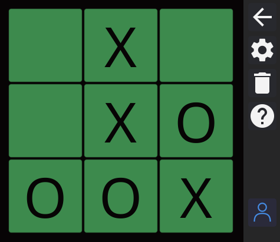

### 3D Tic-Tac-Toe

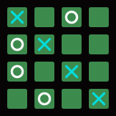

[3D Tic-Tac-Toe](https://en.wikipedia.org/wiki/3D_tic-tac-toe) or Oxo3d as we call it here is a beefier version of noughts and crosses played on a 4x4x4 grid shown as four layers. X goes first. Get four in a row in any direction to win, horizontally, vertically, diagonally within a layer, or through layers. With 76 possible winning lines, there is rather more to think about than the 3x3 version.

Watch out for tricky diagonal lines!

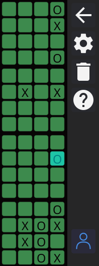

### Dots and Boxes

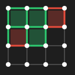

In [dots and boxes](https://en.wikipedia.org/wiki/Dots_and_boxes) two players take turns drawing lines between dots on a grid. If you complete the fourth side of a box, you claim it and take another turn. When all lines have been drawn, the player with more boxes wins. Sounds simple, but the endgame strategy runs surprisingly deep.

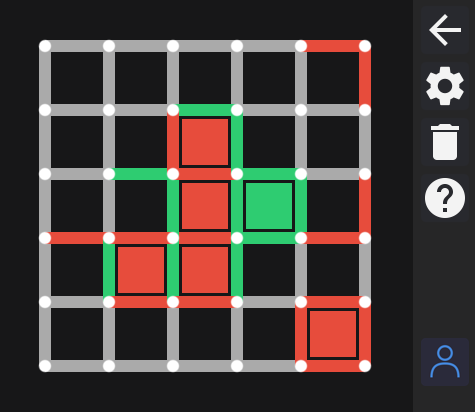

### Domineering

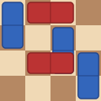

In [Domineering (also called Stop-Gate or Crosscram)](https://en.wikipedia.org/wiki/Domineering) two players take turns placing dominoes on an 8x8 grid. Player 1 places vertical dominoes (covering two squares top-to-bottom) and Player 2 places horizontal ones (left-to-right). Dominoes cannot overlap or go off the board.

The first player who cannot place a domino loses.

A quirky little [combinatorial game](https://en.wikipedia.org/wiki/Combinatorial_game_theory) that rewards careful territory management.

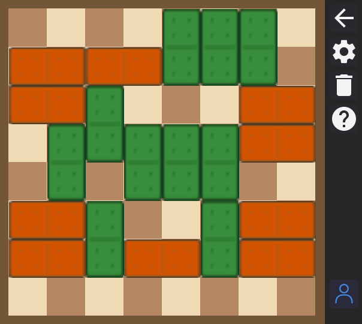

## The Engine

All ten games share the same AI engine. It knows nothing about any particular game - each game simply implements a common interface (legal moves, make/undo move, evaluate position) and the engine does the rest.

### Minimax with Alpha-Beta Pruning and Iterative Deepening

The engine searches the [game tree](https://en.wikipedia.org/wiki/Game_tree) using [the minimax algorithm](https://en.wikipedia.org/wiki/Minimax) with [alpha-beta](https://en.wikipedia.org/wiki/Alpha%E2%80%93beta_pruning) pruning, which lets it skip over branches that cannot possibly affect the result. It uses [iterative deepening](https://en.wikipedia.org/wiki/Iterative_deepening_depth-first_search) - searching first to depth 1, then depth 2, and so on - so it always has a reasonable move ready even if time runs out mid-search. The transposition table (see below) stops work being duplicated between searches.

### Lazy-SMP

At the highest difficulty levels the engine searches in parallel using [Lazy-SMP](https://www.chessprogramming.org/Lazy_SMP) Parallelism. Multiple threads explore the same tree independently, sharing a transposition table but otherwise working on their own. Threads start at staggered depths so they naturally explore different parts of the tree. A voting mechanism picks the best move from the results.

### Move Ordering

Good [move ordering](https://www.chessprogramming.org/Move_Ordering) is critical for alpha-beta pruning - the sooner you look at strong moves, the more you can prune. The engine tries the best move from a previous search of the same position (known as the hash move) first, then orders captures by most valuable victim, least valuable attacker ([MVV-LVA](https://www.chessprogramming.org/MVV-LVA)). Games can also flag moves as "busy" for the quiescence search (see below). Games implement their own move ordering, or can just mark moves as busy.

### Transposition Table

Positions are stored in a lock-free [transposition table](https://en.wikipedia.org/wiki/Transposition_table) and most games use [Zobrist hashing](https://en.wikipedia.org/wiki/Zobrist_hashing) to uniquely identify a position. Each slot is 32 bytes, accessed with atomic operations so no mutexes are needed even with concurrent search. The table uses age-based replacement - entries from older searches are gradually overwritten - and is reused between moves to preserve useful work.

### Quiescence Search

At the leaves of the main search, the engine continues searching "noisy" moves (captures, checks, and other forcing moves) in a process known as [quiescence search](https://en.wikipedia.org/wiki/Quiescence_search). The search continues until the position is quiet (all the captures have happened). This stops the engine from making decisions based on a position where a piece is about to be captured.

### Aspiration Windows

Rather than searching with a fully open window, the engine starts each deepening iteration with a narrow [aspiration window](https://en.wikipedia.org/wiki/Aspiration_window) around the previous score. If the true value falls outside, it re-searches with a wider window. This produces more cutoffs in the common case and speeds things up nicely.

## The GUI

The GUI is built using the [Fyne](https://fyne.io/) toolkit which is an easy to use cross platform GUI toolkit for Go.

## Building from Source

You will need Go 1.23 or later. Clone the repository and build:

```bash
git clone https://github.com/ncw/compendium.git
cd compendium
go build .
./compendium
```

To run the tests (the `-short` flag skips the slow chess perft suite):

```bash
go test -short ./...
```

## Contributing

Found a bug? Got an idea for an improvement? Contributions are welcome.

- **Bug reports** - open an [issue](https://github.com/ncw/compendium/issues) with a description of what went wrong, what you expected to happen, and which game you were playing. Screenshots are always helpful. The log written to standard output is useful too.
- **Pull requests** - fork the repository, make your changes on a branch, and open a [pull request](https://github.com/ncw/compendium/pulls). Please run the linter and tests before submitting:

  ```bash
  golangci-lint run
  go test -short ./...
  ```

- **Commit messages** - use a lowercase prefix with the area of the
  change, e.g. `chess: add FEN parser` or `engine: improve move ordering`.

## Author

Written by Nick Craig-Wood (nick@craig-wood.com). Enjoy the games!
