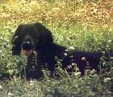
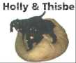
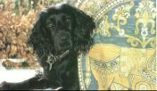
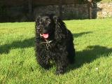

Holly was our Cocker Spaniel.  She was a loving dog but a little
bonkers!  There was nothing she enjoyed more than howling along while
we were singing, or eating socks.  Unfortunately Holly is no longer
with us, having chased a rabbit off a cliff at the fine old age of 14.
Here are some pictures of that much loved dog.

<dl>
  <dt>Holly in a field</dt>
  <dd></dd>
  <dt>Holly and her Cousin Thisbe</dt>
  <dd></dd>
  <dt>Holly in Cornwall</dt>
  <dd></dd>
  <dt>Holly in her element</dt>
  <dd></dd>
</dl>
