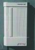

This page is of historical interest only. I put these pages up for the
enjoyment of all I **don't** sell or deal in ISTECs - you will have to
look elsewhere for that.

The economical and easy to use ISDN private exchange
    
## Summary of the features

- 1 S0 interface to the public network
- 8 analogue a/b interfaces
- Door intercom interface
- Pulse / Tone dialling
- 1 RS232 interface for setup / billing
- Configuration software
- Charge metering
- Call transfer
- Inquiry call
- Internal 3-way conference
- Broker call
- Call pick up
- Music on hold
- Call barring (call number blocking)
- 4 Classes of external call authorization
- External call rerouting
- Internal call rerouting
- Pickup from answering machine
- Selectable service ID for each line
- Direct dialling to each extension
- Free assignment of MSN and grouping
- General access transfer
- Protocol E-DSS1/1TR6 PTMT or PTP

The ISTEC 1008 is an easy to use digital communication system
developed especially for small offices, such as tax consultants,
lawyers, engineers, self employed,......., and also for the modern
home.

The private exchange provides an economical way to operate analogue
terminal equipment on an ISDN S interface. The a/b interfaces enable
the operation of any conventional certified terminal equipment such as
Group 3 Fax machines, modems, answering machines, and both cordless
and other telephones on the ISDN network.

The ISTEC 1008 detects which dialling mode - DTMF tone or pulse - is
used on the a/b interfaces. The system can operate with either
EURO-ISDN protocol (DSS1) or the German 1TR6 protocol, and can be used
on either an S bus or ISDN PBX line.

A few of the especially user friendly features are the direct dialling
of extensions, selectable service ID for each extension, the easy to
use configuration software, and also the rerouting of both internal
and external calls.

The ISTEC 1008 consists of a central unit in a plastic case with 8 a/b
interfaces, a standard network connection cable, and an external power
supply. The system is ready for use on the ISDN network without any
special setting up, in three easy steps: 1, connect the power supply
cable: 2, connect the network cable to the ISDN socket: and 3, connect
the analogue terminal equipment........
