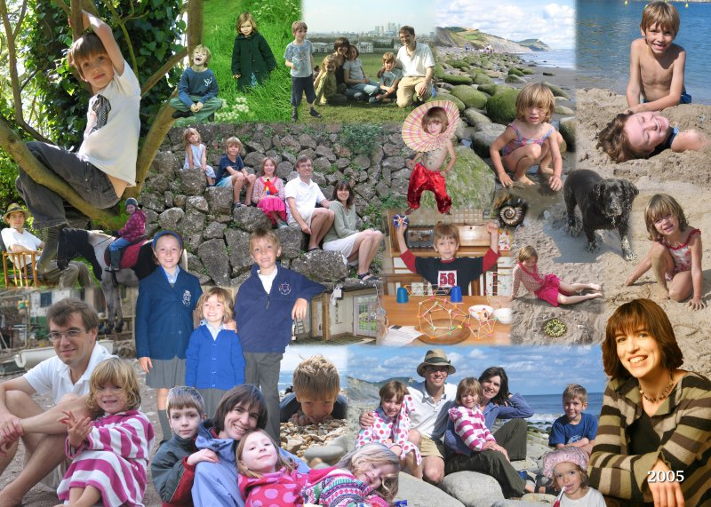

We started 2005 with New Year in Cornwall (at Treharrock) with friends
- a very enjoyable time.  Conrnish trips have been plentiful again but
this year varied with other destinations.  Thanks to Tristram
(Loveday's brother) and Claire getting married, Loveday managed a
weekend away in Paris and Nick got to go to Brussels. Dancing and
revelry was enjoyed until morning on both occasions!

In June we started our long planned work on the kitchen.  You can see
a small picture of the works in progress just below centre. It has
involved major demolition to the house including removing the kitchen,
utility room, play room and Ed's bedroom from use.  We are knocking
the downstairs rooms into a bigger family kitchen with eating area
which is nearer the centre of the house and a utility room by the back
door.  We have a temporary kitchen in the dining room which has worked
surprisingly well.  As with a lot of building projects things have not
run smoothly - we look forward to having a floor and a kitchen!

Earlier in the year Nick's mother Judy took a turn for the worse.
Unfortunately her cancer was discovered to have spread to her brain.
She became quite ill quite quickly but was determined to stay at home
where John cared for her superlatively until she died in July. It was
lovely to see those friends and family who joined us at her house in
Cornwall to celebrate her life.

Look for the stony beach pictures and you'll see our August holiday in
Charmouth, Dorset.  We divided our time on the beach between the usual
beach things and looking for fossils.  This involved quite a bit of
whacking rocks with a geological hammer which everyone was rather fond
of.  The picture of the fossil is as we found it on the beach -
amazing!

Amy and Loveday went riding together in the beautiful Black Mountains
in Wales for 3 days.  Maybe we'll all go next year!  In September Nick
helped to crew Uncle Pete's boat from Gibraltar to Lanzerote along
with Uncle Ian - a special treat indeed!

All 3 children started new schools in September.  Amy and Isabel have
settled well at Longacre in Shamley Green and Ed is loving his
school too.  You can see them in their new school uniforms
at centre left.

The rest of the beach pictures are from our October holiday to
Mallorca.  We stayed in the same villa as our trip of 2002 in the
sleepy mountain village of Fornalutx. The stone steps we are sitting
on (centre) are typical of the area with its terraced orange and olive
orchards.  Ed and Amy enjoyed going to the village shop on their own
in the morning to buy breakfast.  Their parents enjoyed not having to
get out of bed quite so early!

We are looking forward to our new kitchen in 2006 and inviting you all
to come and see it!

