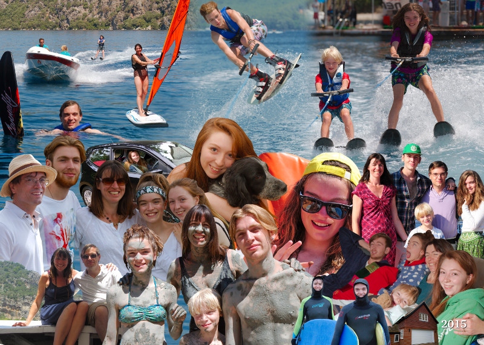

We brought in this year by spending Christmas and New Year at Polzeath beach in Cornwall where we had a lovely time with family and friends.  It was our last Christmas with Loveday's mother Elizabeth who died of pancreatic cancer in February after a 4 month illness.  She was cared for at home by her children until the end which was an intense but rewarding experience.

After that we needed a holiday so all 6 of us spent Easter in Barcelona where we had good weather and Nick got to see the Dali museum which has been a lifelong ambition.  Not all the children were terribly impressed by the culture! Soon after we started rebuilding our garage, attaching it to the house with extra rooms above, so imagine the rest of the year to the background of builders.  The builders have done a great job and finished just in time for Christmas.

In July 5 of us spent 2 weeks in Turkey near Marmaris mostly relaxing with a bit of watersport and a few visits to local highlights such as the mud baths.  Dougal learnt to sail, windsurf and waterskii all in two weeks which was amazing.  Later in the summer we had a really enjoyable week at Treharrock with university friends and their families.

Amy (19) is in her second year at Brunel University.  She is enjoying leaving projects to the last minute and, having swapped 4 legs for 4 wheels, driving between home, uni and boyfriend.  Her passion for horses is being kept alive at university where she is captain of the riding team.  This seems to mostly involve lots of meetings and sorting out arguments.  She is currently working at PC World selling cameras and declining unwanted offers of marriage.

Ed (18) and school had a mutually agreeable parting of the ways after his AS results and he is now studying at the university of life.  He spend a few weeks as a builder on our building site and gave the garage a thorough christening by inviting 100 people for his 18th party.  He is now working full time at Côte restaurant as a commis waiter where he enjoys visits from his family.  He still loves skateboarding despite having broken his collarbone while going off piste down a grassy bank in the spring.

Isabel (14) became the second member of the family to help organise a Quaker event (YPP).  She loves these events and has been to several this year.  She continues her iPad addiction and hasn’t stopped complaining about the consequent WiFi curfew! She enjoyed bringing her friends to Cornwall and has been making good progress at school.

Dougal (8) is really getting stuck in at his new school proving himself a determined football and rugby player.  At home his new hobby is weaponising stationery and using Isabel for target practice.

Loveday and Nick have both been extremely busy in 2015.  Nick has being doing more management at Memset but has preserved his sanity with art classes and a writing open source software.  Loveday has overseen the building work, had many trips to Cornwall and excitingly taken on the management of Treharrock with a bit of Yoga to de-stress.

