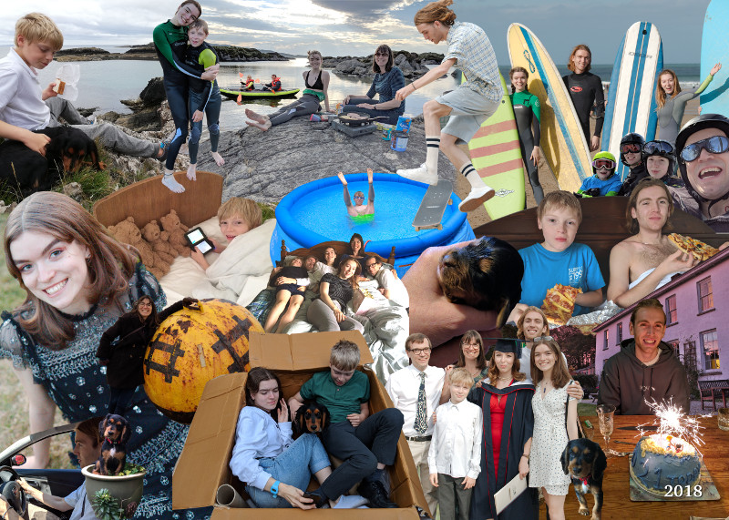

Firstly apologies that the photomontage didn’t make it to press in 2017!

Alas our beloved Daisy left us in November 2017.  We remained dog-less until January when we went to see Pepper, a black and tan cocker spaniel.  Pepper came to live with us in March and has been eating everything ever since.  High scores so far: 2 pairs of glasses, 1 passport and Nick’s favourite Rubik’s cube!  Fortunately she has the sweetest temperament so it is impossible to be cross with her for long.

In March, Amy and the boys went to Sauze d’Oulx in Italy for skiing and pizza. In July 4 of us (+dog) had a fun week in a caravan in Scotland on the Ardnamurchan peninsula. We took inflatable kayaks with us and had great fun paddling round the beautiful scenery in between the showers and driving to distant lay-bys to get 3G signal for Issy. August saw us in Cornwall with a wet visit to Boardmasters festival. Ed competed in the Guildford skate jam unfortunately breaking something in his foot (we couldn’t have a message without a broken something from Ed!).

In October we reluctantly had to say goodbye to another old friend: Treharrock Manor in Cornwall. All the Hambly family came to help with the mammoth clear out.  Fairholme now looks like an antique dealers storeroom. Nick hopes to be able to get his car back in the garage sometime next year!

Amy (22) graduated with a degree in digital design from Brunel and moved back home bringing her boyfriend Jack. In October she finally had the jaw operation she has been expecting for 7 years. At last she can bite things things properly! She has been working for Dad making <a href="https://www.memset.com">Memset’s new website</a> which she has done a splendid job of.

Ed (21) has celebrated his 21st birthday, passed his driving test and completed a successful year in sales at Vodafone. He is enjoying working all day then going out every night (ah to be young!).

Isabel (17) survived her GCSEs in the summer and was happy with the results.  She has now moved to a new school for the 6th form, and in an epic act of rebellion against her scientific parents is studying English, History and Religion & Philosophy. She continues to enjoy young Quaker activities and has chopped off most of her hair.

Dougal (11) has moved to a new school. It is a positive and encouraging environment and he is more relaxed at school than before. He has been playing football for a local club and doing a lot of computer gaming in his spare time. He has made his old man proud by learning to solve the Rubik’s cube.

Nick has taken on the CEO role at Memset which has brought new challenges but he has the support of a great team. His spare time hobby has been his Open Source project <a href="https://rclone.org/">rclone</a>.  Nick even gave <a href="https://youtu.be/L1OLet9qviQ">a talk about rclone</a> which you can find on YouTube. Loveday’s year has been busy managing and preparing to sell Treharrock.  This has been both very sad and a great relief. She is looking forward to a slightly quieter life next year with time to read all the books from her book clubs.

