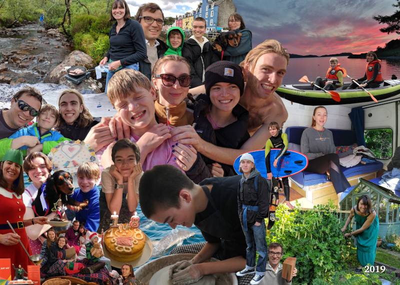

We were obviously very naughty in 2018 because Santa brought us norovirus for Christmas which spread through the family and laid us low for a week. Hopefully this year we’ve behaved better!

Nick and Dougal had 2 ski trips this year. The first in February with Amy and cousins Olly & Felix to Sauze d’Oulx, Italy. Things went well except when Amy’s blood sugar dropped too low and the time Dougal lost his snowboard down a red run… The second time was in April; this time with Ed, who, in true Ed style, managed to send his passport to the Russian embassy for a visa just before the trip, leading to a mad panic on the day of the flight and Ed missing half the holiday!

In April it was our 25th wedding anniversary.  We had a party at home and it was lovely to see so many of you there. Revisiting the wedding video provided plenty of entertainment and lots of “who’s that” moments.

In July we went to the west coast of Scotland for a “summer” holiday. When the weather was good it was lovely and when it wasn’t we got very wet. We played our traditional game of cooking sausages wherever we went.  The highest scoring round was cooking on a rock in the middle of a river. We went to the Isle of Canna so Loveday could revisit her teenage years and were lucky enough to see a large pod of dolphins on the way.

 

Amy (23) and boyfriend Jack converted an old transit van into a camper (see pic). They spent the summer travelling round Europe, returning briefly to have Amy’s braces removed (hooray!) and again to fix a bit of engine bother (“seaweed in the tank”). In August, Amy left home (sad face) and has <s>run away to the circus</s> gone to live in Bristol, joining the graduate program for “Just Eat” in their design department where she works on the user experience (UX) of their app and website.

Ed (22) left Vodafone in March to travel through Northern Europe to Moscow for 6 weeks. He then went again ending up in Scandinavia this time. After getting underfoot at home for a few weeks we packed him off on a snowboard instructor course in Austria. He passed his test (in German!) and has now just been let loose teaching in Ellmau for the season.

Isabel (18) completed the job of chopping off her hair (for charity). She has enjoyed more Quaker events this year. A-levels are looming but she has decided to take a year out after them to delay having to fill in the dreaded UCAS form.

Dougal (12) has spent almost every moment of his spare time playing computer games. His voice has been breaking and he has been growing, soon Amy will be the smallest in the family! School and rugby have been going well this year. Pepper won the “loveliest lady” prize in the school dog show; thank heavens she wasn’t wearing her “Foxy Lady” scent!

Memset has been keeping Nick busy, celebrating 10 years being carbon neutral (you can see Nick with the award in the pic). Loveday enjoyed crochet and cookery courses and a trip to Iceland in August for her sister’s birthday where much lounging around in bathrobes was done. She then decided she was bored so signed up for a part time MSc in “Sustainability & Ecology” from the <a href="https://www.cat.org.uk/">Centre for Alternative Technology</a> in Wales. New Year’s resolution: learn to type!

