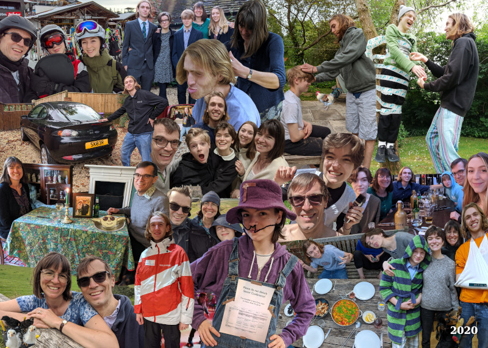

2020 has been the best of times and the worst of times. As a family of dedicated introverts (with one exuberant exception) we’ve enjoyed spending more time at home together, meals in the garden and long walks in the local area with Pepper.

The year opened with Nick finalising the sale of Memset after more than a year of intensely stressful negotiations, made harder by Nick’s sister and business partner Kate’s deteriorating mental health. Luckily Ed’s position teaching snowboarding in Austria gave the perfect excuse for a February half term holiday. Unluckily - and perhaps predictably, if you’ve been reading these messages long enough - Ed broke his arm just before we were due to visit Ellmau meaning we had to go skiing without him. Thankfully the sale of Memset completed in March. Unfortunately this was just before the first lockdown which meant Nick was unable to say a proper goodbye to everyone who worked there.

Lockdown meant Issy finished Upper Sixth very suddenly, without taking her A-levels or experiencing the usual rites of passage that come with leaving school. Dougal loved spending more time at his computer but home schooling and remote Common Entrance exams turned out to be less fun than Roblox. To entertain ourselves in lockdown we incubated and hatched some eggs - we now have two fine hens and their noisy brothers have moved to the countryside.

Amy, who works for Just Eat, spent the first part of the year in Bristol. In May she returned home in her new red van (which we keep mistaking for the postman!). She used her time here to build in a tiny kitchen and a very ingenious folding bed. Nick helped her with the electricals and then she set off to explore the UK with friends over the summer.

Ed’s broken arm took a while to heal which made getting a job in lockdown challenging. He briefly had a job in Guildford  but since September has been working in Godalming, helping people save money by switching their broadband and electricity suppliers. With his first month’s pay he bought a new car (and the new wing mirror he needed after taking it out for the first time). Issy hopes he will have enough money to move out soon so that she can have his bedroom.

Through the year Issy helped organise Quaker Senior Conference. Normally this is a residential event but Issy and the team rose to the challenge of taking it online this August. We weren’t allowed to join in, but Issy’s timetable on the door let us know what she was up to. Since September Issy has been studying Early Years Education at Guildford College.

Sadly, Kate died in September of what we think was a drug overdose. This was quite a blow as she’d just come back from the Priory and we had hoped she was getting better. Having a lockdown funeral was strange with only 17 people allowed to come, but we sent her off in style with a pink glittery coffin and a motorcycle hearse.

Loveday is continuing her part time MSc in between Zooming with the Quakers, knitting, gardening and looking after the family. Nick is gradually de-stressing and has been putting more energy into his open source software rclone. The 3 week Italian adventure we were looking forward to was cancelled, but we did manage holidays in Cornwall and took a wet and windy trip to Northumberland in August. Hopefully we will have some Cornwall related news to share in 2021.
