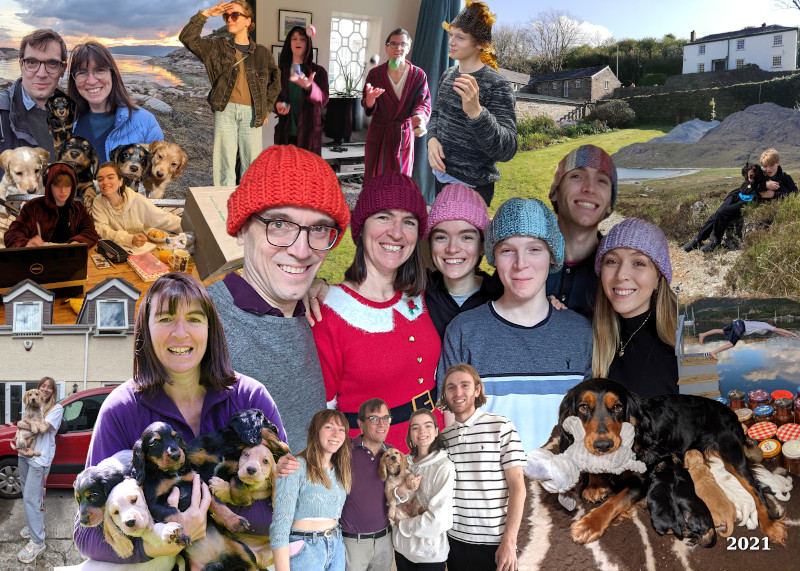

We had a very exciting end to 2020 as we completed the purchase of The
Mill in Port Isaac just before Christmas. Our new Cornish stronghold
is an old miller’s cottage and converted watermill. Our plan is to
move there in a few years but we are open for holidays now if you’d
like to visit.

In March 2021 Pepper had a lovely multicoloured litter of 5 puppies.
Pepper and her puppies accompanied us on our first family visit to The
Mill as soon as lockdown lifted, the children having been unable to
visit before. Pepper was an excellent mother and the puppies have all
gone to friends and family, with Amy adopting Oggy (our first
grandpuppy!).

In June we went on Holiday to Plockton in Scotland. The weather was
amazing for exploring the beautiful scenery. While there we met up
with old friends and Tristram and family. Dougal and his cousins had
lots of fun jumping into cold lochs.

We decamped to Cornwall for most of the summer to explore our new
demesne. Lots of friends and family came to see us there – having new
visitors every week was great fun!

Amy bought her first house in Bristol and moved in with Oggy and Ziggy
her red van. She is a UX designer for Just Eat and hangs out with the
‘Waves and Paves’ girls. Amy, boyfriend Sam, Oggy and Ziggy enjoyed
the NC 500 this summer.

In March Ed moved out. He and his girlfriend Phoebe are renting a flat
together in Woking though he returns home regularly to raid the
fridge. Ed worked for Money Expert selling energy and broadband for
most of the year but now has a new challenge learning how to be a
financial adviser with Neilson Place.

Issy has been doing the second year of her Early Years Education
course at Guildford College and has loved doing work experience in our
local nursery, pre-school and primary school. She has been having fun
with her new college friends and is looking forward to studying
Liberal Arts at university next year.

Dougal has started his GCSE courses at school. Lockdown school went
much better this year, helped by a dedicated laptop (no games!) and
the school running live online lessons. He did his first overnight
adventure with the school for his Bronze DofE. When not at school he
enjoys gaming, surfing and skateboarding, both with and without his
big brother.

In June Nick passed his Radio Amateur’s exam and now has the callsign
2E0WPM. At the Gophercon UK conference in October he gave a talk about
deadlocks which went very well. He’s been working on rclone and doing
software consultancy while taking time out to learn Morse Code, do
radio experiments and help Loveday make lots of Uncle Rick’s spicy
pickle!

Loveday is continuing to do her Masters very slowly. She has been
getting The Mill ready to let, doing lots of Quaker related activities
including marching with her banner during COP26 and has been
volunteering with Zero Carbon Guildford.
