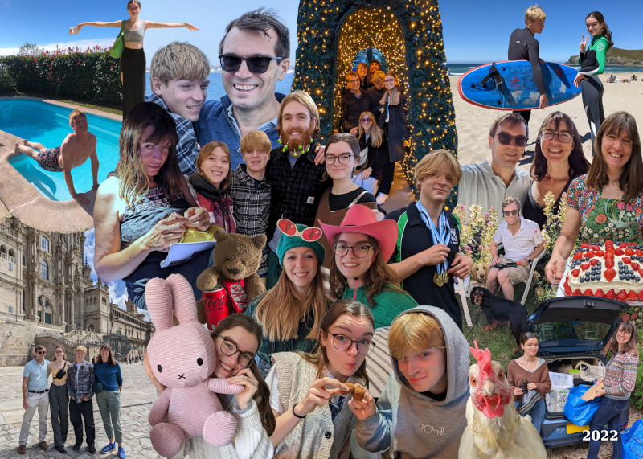

We’d love to blame the lateness of this card on the postal strikes; in
reality it is because we have been even less organised than usual! We
hope you had a lovely Christmas and this reaches you in time for New
Year.

2022 has been a relatively quiet year for us. Nick booked a ski trip
in March but unfortunately covid hit just before the trip so Ed,
Phoebe (Ed’s girlfriend) and Dougal went without him. Amazingly, they
came back in the same number of pieces that they went!

In August, Nick, Loveday and Dougal took the ferry to northern Spain
where Issy and her friend Emily joined us after interrailling through
France and Spain. We stayed near A Coruña and enjoyed surfing and
exploring cities such as Santiago and Lugo, and the beautiful
coastline. The roads were excellent but Loveday was disappointed by
the endless eucalyptus plantations (for paper) which have replaced
much of the native flora.

We’ve had several trips to The Mill in Cornwall, including Easter with
friends, where we went for walks along the cliff paths, worked on the
garden and made plans for future renovations.

Amy (26) left Just Eat to join Olio as a UX Designer in a fully remote
job. She bought a new van and spent many happy hours converting it
into a camper and getting Dad to do the electrics before taking off to
Ireland for a fortnight. She’s currently a digital nomad on her way to
South Africa for 2 months, leaving Oggy behind.

Ed (25) spent part of the year working for an outfit selling whiskey
barrels by the pallet and is about to start a job in Basingstoke as an
insurance protection adviser. He had a lovely holiday with Phoebe in
Canada.

Issy (21) completed her Early Years Education course in June and had a
summer of fun, including Shambala Festival with Amy. She has survived
first term of university at King’s College London, studying Liberal
Arts.

Dougal (15) has been enjoying skateboarding with Ed and his school
friends. He’s passed the 6th form entrance exam for his new school in
Guildford so will be able to walk to school – hooray. GCSEs first
though!

Nick (M5NCW) built his first portable transceiver and used it to make
Morse code contacts in Europe while sitting in the garden in Cornwall.
Having been a fan of Formula 1 for many years it was a real treat to
attend the British Grand Prix for the first time to see an especially
eventful race. Nick continues to do consultancy and work on his rclone
project.

Loveday started the year very busy with her postgraduate studies in
Ecology and Sustainability completing her diploma but deciding not to
do the master’s dissertation. She has been heavily involved in Quaker
activities including organising a weekend retreat. She loves meeting
up with her book group friends and volunteering at Zero Carbon
Guildford, where she helps run the community fridge.
