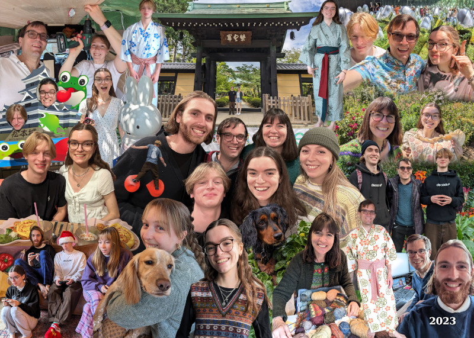

2023 has seen lots of foreign travel for everyone except Loveday. It
started with Amy leaving for Dubai, South Africa and Senegal. Nick,
Ed, Phoebe (Ed’s girlfriend) and Dougal went on the ski train to
France and enjoyed a week of late season skiing - with no broken
bones!

Nick, Issy and Dougal had a spectacular trip to Japan in the summer
for wonderful food, toilets, sights, cleanliness, trains, Anime and
cheap amateur radio equipment. It was very hot though! We finished the
trip with 3 days in Korea and ate lots of delicious barbecued meats,
fried food and desserts.

Trips to The Mill in Cornwall: lots, number of redesigns considered:
→∞, number of designs finalized: 0, number of things decided: NaN.

The children remain alive, but one year older ignoring relativistic
time dilation effects due to the travelling.

Amy has had a busy year converting her van, travelling, surfing,
climbing and working at Olio. Sadly Olio seem to be running out of
runway so Amy was made redundant in November. She immediately booked
her dog into the dog sitters (us!) and a flight to Sri Lanka for 3
weeks of surfing in January!

Ed started the year as an advisor for Reassured but decided to come
and work with Dad for a few months (while making skateboard videos on
the side) before setting off travelling with Phoebe for 3 months round
SE Asia, Australia and NZ.

Issy is in her second year at uni studying liberal arts (a bit like
literary arts with a helping of TV studies). When not working she has
been helping out with the children at Quaker meeting. She has taken up
a troglodyte existence in a basement in Archway and would love a visit
if you don’t mind the fungus!

Dougal got an excellent set of GCSEs and has started at a local school
for 6th form. At last, after 23 years, Loveday is free of school runs!
Dougal is doing Maths, Further Maths, More Maths and Even More Maths
(disguised as Computer Science and Electronics). He is also doing a
lot of climbing (rocks rather than social).

Nick had a paper published on his Pi obsession ([Euler found the first
binary digit extraction formula for π in 1779](https://scholarlycommons.pacific.edu/euleriana/vol3/iss1/3/)) so
can concentrate on other stuff finally! He also set up a little
company [Rclone Services Ltd](https://rclone.com/) to run support
contracts for his open source software. Ed has been very useful
helping with sales and marketing.

Loveday has monetised Nick this year giving him the push to set up his
new company. With her new found free time she’s been knitting at 44.7
ms⁻¹. She has also has become the treasurer of Guildford Quaker
Meeting, been volunteering at [Zero Carbon Guildford](https://www.zerocarbonguildford.org/)
and demonstrating for the climate and peace.
