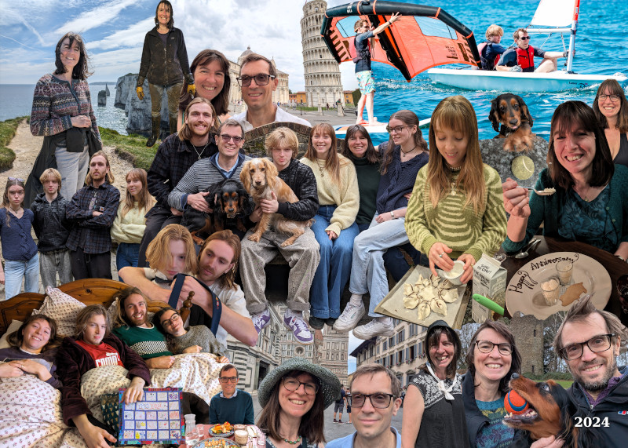

We've enjoyed time at home in 2024 with plenty of lunches with the boys as Ed is working with Nick and Doug usually drops in for his lunch hour. Highlights of the year have included: a ski trip to Andorra with Loveday's brother and Doug's cousins; quality time for Loveday getting muddy at The Mill and planting 300 trees; hosting two Chinese students from Nanjing, Albert and Alice; an Easter trip to Cornwall with friends and family; celebrating our 30th wedding anniversary with a stay at The Pig on the Beach in perfect weather; seeing [Loveday Hambly](https://www.cornwalllive.com/news/cornwall-news/blue-plaque-helps-commemorate-quaker-9411030)'s (Loveday's famous Quaker namesake) blue plaque being unveiled at Tregongeeves in Cornwall; and attending an Emmanuel College re-union.

Our big adventure of the year was a summer holiday in Sardinia. The family wanted to do watersports in the sun – but Loveday refused to fly. How to square that circle? Loveday and Nick took the train, stopping off in Paris, Milan and Florence, spent 2 weeks by the sea with the family, and then returned via Pisa, Genova, Ventimiglia and Nice. The train journeys bookending the trip made it very memorable holiday.

Amy started the year travelling while the grand-puppy (Oggy) stayed at Fairholme. In May she joined The Land App as a digital designer after a longer-than-expected gap. She works a nine day fortnight leaving time for adventures in her converted van accompanied by Oggy and her boyfriend, Jake.

Ed has been helping Dad with the business side of [Rclone Services](https://rclone.com/) when he can fit it in between learning and filming skateboard tricks and sleeping. He had a great interrailling trip with Phoebe visiting eastern Europe and skateboarding with his mates in Prague and Poland. Dad is getting him an alarm clock for Christmas.

Issy is in her third year at uni studying liberal arts, for some definition of studying at least. She hasn't been in the best of health this year but she is happier in her new flat. She enjoyed visiting her friend Emily in New York and won a poetry competition with her poem [Love Can Give You This Cool Shark (Journal Entry)](https://poems.poetrysociety.org.uk/poets/issy-craig-wood/).

Dougal's deep in Year 13 now, grinding hard on his skateboard, CompSci and Electronics projects. Man's fully locked in for his A-levels. He'd say I'm glazing him, but trust me - bro's gonna get the W.

Nick has been busy this year with his new business. All good fun though – writing open source software and supporting paying customers is a nice change of pace and much less stressful than previous enterprises. In his spare moments he has been accumulating half-completed maths, radio, software and electronics projects.

Loveday at last decided on a design for The Mill and we got planning permission! Whether it will get built anytime soon is a different matter. She and Issy volunteered on the children's program at Quaker BYM. She has also been very busy with local Quakers, Zero Carbon Guildford and her pesky family always wanting things!
