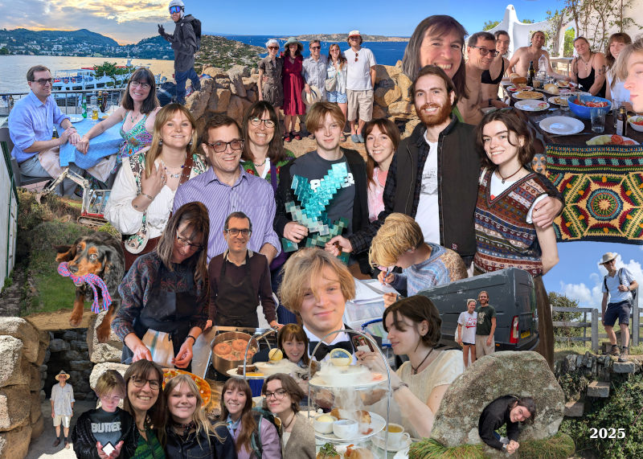
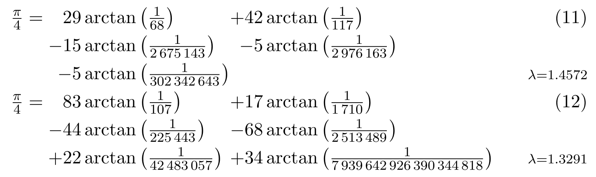

2025 has been a year of courses, A-levels and a building project.

Highlights include: a cookery course for Loveday and Nick at River Cottage; skiing in Kitzbühel; hosting Britney from Nanjing; a (baffling to some) visit to the Minecraft experience for Dougal’s 18th birthday; a party to celebrate the end of school; a fantastic family holiday in Sardinia with Loveday’s siblings scattered around Porto Rafael in seaside villas; a holiday with uni friends in Cornwall; the start of the renovations at The Mill and a crochet holiday in Morocco for Loveday.

Amy is doing well at her work at The Land App when she can spare time between holidays and van adventures with her boyfriend Sam and Oggy (her dog). She bravely drove her van to Sardinia stopping off for climbing in Fontainebleau with Doug.

Ed is still working with Nick. He and Phoebe (who is making an appearance in the card for the first time) have just celebrated 5 years together. They moved out of Guildford in the summer into their own flat in London, even taking most of their stuff with them.

Issy finished her degree – hooray! As Ed moved out of the flat above the garage, Issy moved in. She is now taking some time off to think about what she is doing next.

Dougal did a lot of studying sitting in the corner in Nick’s office. He got an excellent set of A-levels and has applied to study Computer Science at university next year. He had a great trip to the US with his cousin Olly and is now also working for Nick writing software. He still finds plenty of time to shout at his computer while gaming with his friends.

Loveday and Nick have been enjoying swimming together a couple of times a week and having more time to walk the coast path in Cornwall. As we did last year, we travelled to Sardinia on the train enjoying time in Paris and Lake Como which was very special. Loveday vetoed all the pictures of her looking like a beetroot after we climbed to Brunate so you’ll just have to imagine it.

Loveday has been extremely busy this year with Quakers, various courses (gardening, Alpha, agroforestry), and the start of work at The Mill. Nick has given up trying to remember where she is.

Nick has had a good year having a lot of fun working with the boys. The business has exceeded expectations. He has been having fun with recreational maths ([arXiv 2508.08307](https://arxiv.org/abs/2508.08307)) discovering an great new formula for Pi!

In October Loveday demolished The Mill. It was nice knowing it. What remains of it is floating in a sea of mud with a few builders mixed in. Or that is what Nick understands since he refuses to come and visit due to the fear of getting stuck in the mire. Hopefully it will get put back together some time next year.

